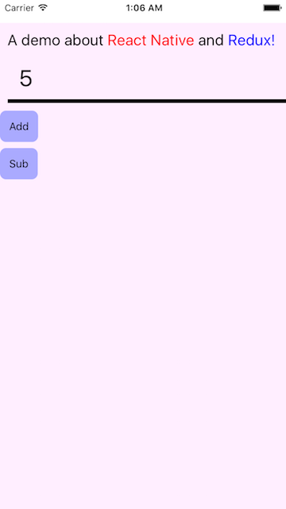

# RNReduxDemo
###This is a demo  how to use React Native and Redux Demo.
###It is a simple application to calculate.

---
How to run this application in ios ?

using npm3 not npm2,

1. git clone git@github.com:xubing/RNReduxDemo.git
2. cd RNReduxDemo
3. npm install 
4. react-native start
5. react-native run-ios  

##
if you want to run ios ,you can open the ios/RNReduxDemo.xcodeproj and run the application or use the above command to run the applicaion in your simulator.

##
if you want toggle software keyboard,pls in your simulator 'hardware'->'keyboard'->'toggle software keyboard'
 
 
 

